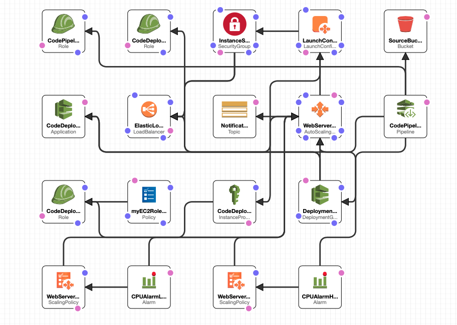
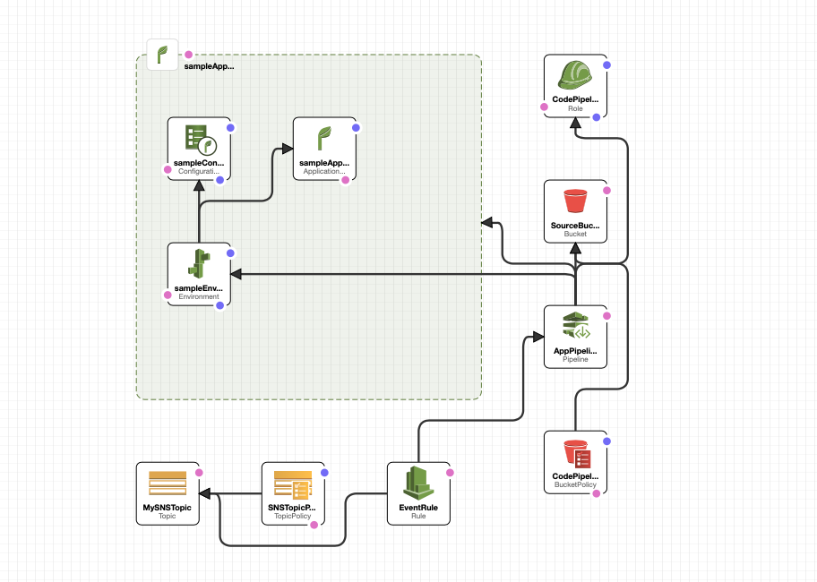

# CREATING INFRASTRUCTURE ON THE CLOUD USING AWS CLOUDFORMATION


[Task Junior DevOps Hiring Day] (https://docs.google.com/document/d/1r3OdJlHtYCN9y_VYSI5B0Na-pg-aW4y5eDiKWk-VSAE/edit)

[Solution] (https://github.com/SergiiGlad/awsjuniorhiringday.git )
```
git clone https://github.com/SergiiGlad/awsjuniorhiringday.git

```


#### AWS CloudFormation is a service that allows the configuring of AWS resources so that developers can focus more on application development, rather than spending time in creating and managing the infrastructure to run an application. It provides a way for the management, provisioning, and updating of AWS resources in an orderly and predictable fashion. In other words, we can say it is a way to enable “AWS Resource Automation.”

## Solution1

AWS CloudFormation Sample Template to create Load Balanced and Auto Scaled sample Web Site running on an Nginx Web Server.
The application is configured to span all EC2  and is Auto-Scaled based on the CPU utilization of the web servers.
Notifications will be sent to the operator email address on scaling events.
The instances are load balanced with a simple health check against the default web page.
**WARNING** This template creates one or more Amazon EC2 instances and an Elastic Load Balancer. "

### AWS Services
---
The following AWS services are used to create a Continuous Delivery pipeline:

  * CloudFormation
  * CodeDeploy
  * CodePipeline
  * S3
  * AutoScaling
  * IAM
  * SNS

  

## Solution 2

Create Elastic BeansTalk Automated Web Site release that deploy site files to  EC2 with auto scaling group and email notification state pipeline."
**WARNING** This template creates one or more Amazon EC2 instances and an Elastic Load Balancer. "

### AWS Services
---
The following AWS services are used to create a Continuous Delivery pipeline:

  * CloudFormation
  * ElasticBeanstalk
  * CodePipeline
  * S3
  * AutoScaling
  * IAM
  * SNS

    
